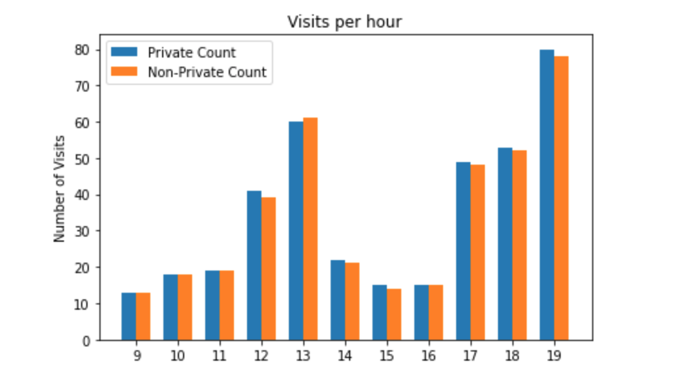
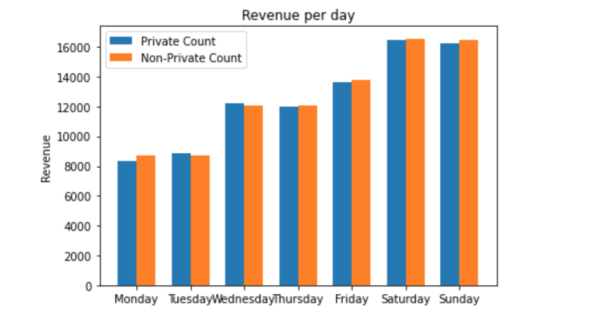
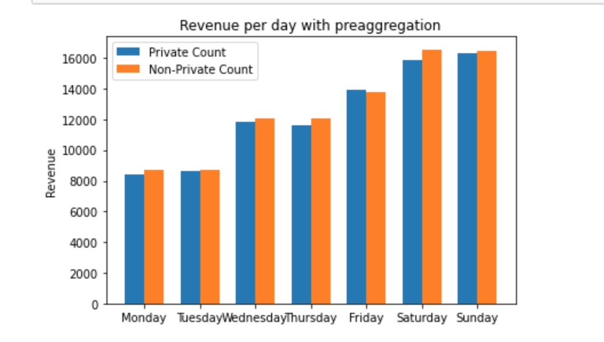

# Example using the Differential Privacy Library

## Restaurant

Imagine a fictional restaurant owner named Alice who would like to share
business statistics with her visitors. Alice knows when visitors enter the
restaurant and how much time and money they spend there. To ensure that
visitors' privacy is preserved, Alice decides to use the Differential Privacy
library.

## Installation
To install PyDP, use the PyPI package manager:

pip install python-dp
(If you have pip3 separately for Python 3.x, use pip3 install python-dp.)

Navigate to `PyDP/examples/restaurant_demo` folder. Execute `Python restaurant.py`

The output will display Private and Non-Private counts for:
* Count visits by hour of day
* Count visits by day of week
* Sum-up revenue per day of the week
* Sum-up revenue per day of the week with preaggregation

Non Private Count is the raw counts and output
Private count is anonymized Counts and output using Differential Privacy library

## Count visits by hour of day

In this example Alice wants to share this information with potential clients in
order to let them know the busiest times in the restaurant. For this, we will
count how many visitors enter the restaurant at every hour of a particular day.
For simplicity, assume that a visitor comes to the restaurant at most once a
day. In other words, a visitor is present at most once in the whole dataset.

Visit data for a single day is stored in the `day_data.csv` file. It includes
the visitor’s ID, the visit duration (in minutes), and the money spent at the
restaurant.


This triggers the logic of `CountVisitsPerHour`. It reads the daily statistics
and calculates the number of visitors that entered the restaurant every hour of
the day. The calculation is done twice.

*   First, `CountVisitsPerHour` computes the raw counts and outputs them to
    `non_private_counts_per_hour.csv`.
*   Next, `CountVisitsPerHour` calculates private (anonymized) counts using the
    Differential Privacy library and prints them to
    `private_counts_per_hour.csv`.

The image below illustrates the results. The Orange (right) bars represent the
counts without anonymization while blue (left) bars correspond to the private
(or *anonymized*) counts. You can see that the private values slightly differ
from the actual ones but the overall trend is preserved. For example, you can
clearly see that the restaurant is more busy during lunch and dinner time.



Note that Differential Privacy involves adding *random noise* to the actual
data, so your results will most likely be slightly different.

## Partitions and contributions

We say that the resulting aggregated data is split into *partitions*. The bar
chart for the private and non-private counts each have 11 partitions, one for
each entry hour.

More generally, a single partition represents a subset of aggregated data
corresponding to a given value of the aggregation criterion. Graphically, a
single partition is represented as a bar on the aggregated bar chart.

We say that a visitor *contributes* to a given partition if their data matches
the partition criterion. For example, if a visitor enters between 8 AM and 9 AM,
they *contribute* to the *8 AM partition*.

Recall that in the the example above, a visitor can enter the restaurant only
once per day. This implies three *contribution bounds*:

*   *Maximum partitions contributed*: to how many partitions can a visitor
    contribute? In our example, a visitor can contribute up to one partition. In
    other words, there is at most one time-slot when a visitor with a given id
    can enter the restaurant.
*   *Maximum contributed value*: what is the maximum value that can be
    contributed by a visitor to a partition? In our example, we count the number
    of visits, so the maximum contributed value is simply *1*.
*   *Maximum contributions per partition*: how many times can a visitor
    contribute to a partition? In our example, a visitor can contribute to a
    partition at most once. In other words, a visitor can enter the restaurant
    only once at a given hour.

Why is this important? Differential Privacy adjusts the amount of noise to mask
contributions of each visitor. More contributions require more noise.

Next, we analyse for the remaining three cases:

* Count visits by day of week
* Sum-up revenue per day of the week
* Sum-up revenue per day of the week with preaggregation

## Count visits by day of week

The previous example made some over-simplifying assumptions. Now, let’s have a
look at the use-case where visitors can contribute to multiple partitions.

Imagine Alice decides to let visitors know which days are the busiest at her
restaurant. For this, she calculates how many people visit the restaurant every
day of the week. For simplicity, let’s assume a visitor enters the restaurant at
most once a day but multiple times a week.

Visit data for a week is stored in the `week_data.csv` file.

The results are illustrated in the image below.


As you can see, the private values slightly differ from the actual ones but the
overall trend is preserved.

Now, let’s take a closer look at the technical details. Speaking in terms of
*partitions* and *contributions*, the resulting bar chart has 7 partitions: one
for each day of the week. A visitor may enter the restaurant once a day and
hence contribute to a partition at most once. A visitor may enter the restaurant
several times a week and hence contribute to up to 7 partitions. The code below
uses `Count` to calculate the differentially private count of visits for a
single day.

```java
// Number of days a visitor may contribute to is limited to 3. All exceeding
// visits will be discarded.
private static final int COUNT_MAX_CONTRIBUTED_DAYS = 3;
LN_3 = math.log(3)
day_visits = bound_visits_per_week(self._day_visits, COUNT_MAX_CONTRIBUTED_DAYS)
// Construct DP Count.
if not epsilon:
            x = Count(
                epsilon=self._epsilon,
                l0_sensitivity=COUNT_MAX_CONTRIBUTED_DAYS,
                dtype="int",
            )
        else:
            x = Count(
                epsilon=epsilon, l0_sensitivity=COUNT_MAX_CONTRIBUTED_DAYS, dtype="int"
            )
```

### Bounding the number of contributed partitions

The parameter `COUNT_MAX_CONTRIBUTED_DAYS` defines the maximum number of
partitions a visitor may contribute to. You might notice that the value of
`COUNT_MAX_CONTRIBUTED_DAYS` in our example is 3 instead of 7. Why is that?
Differential Privacy adds some amount of random noise to hide contributions of
an individual. The more contributions an individual has, the larger the noise
is. This affects the utility of the data. In order to preserve the data utility,
we made an approximate estimate of how many times a week a person may visit a
restaurant on average, and assumed that the value is around 3 instead of scaling
the noise by the factor of 7.

We also pre-processed the input data and discarded all exceeding visits. The
preprocessing is done by `bound_visits_per_week(self._day_visits, COUNT_MAX_CONTRIBUTED_DAYS)`. It is important
to keep in mind that the library allows you to specify maximum amount of
contributions, but doesn't validate that it is respected.

## Sum-up revenue per day of the week

The previous example demonstrates how the contributed partitions are bounded.
Now, we will demonstrate how individual contributions are clamped. Imagine Alice
decides to calculate the sum of the restaurant revenue per week day in a
differentially private way. For this she needs to sum up the visitors’ daily
spending at the restaurant. For simplicity, let’s assume a visitor enters the
restaurant at most once a day but multiple times a week.

Visit data for a week is stored in the `week_data.csv` file.

The results are illustrated in the image below.



The code below uses `BoundedSum` to calculate the differentially private sums of
the visitors' spendings for a single day.

```java

# Cap the maximum number of visiting days at 4 per each visitor (any number above will not be taken into account)
SUM_MAX_CONTRIBUTED_DAYS = 4

# Expected minimum amount of money (in Euros) to be spent by a visitor per a single visit
MIN_EUROS_SPENT = 0

# Expected maximum amount of money (in Euros) to be spent by a visitor per a single visit
MAX_EUROS_SPENT_1 = 50
MAX_EUROS_SPENT_2 = 65

LN_3 = math.log(3)

  # Use the default epsilon value if it is not given as an argument
        if not epsilon:
            x = BoundedSum(
                self._epsilon,
                MIN_EUROS_SPENT,
                MAX_EUROS_SPENT_1,
                l0_sensitivity=SUM_MAX_CONTRIBUTED_DAYS,
            )
        else:
            x = BoundedSum(
                epsilon,
                MIN_EUROS_SPENT,
                MAX_EUROS_SPENT_1,
                l0_sensitivity=SUM_MAX_CONTRIBUTED_DAYS,
            )
  // Calculate DP result.
  result = x.result();
```

### Clamping individual contributions

The usage of `SUM_MAX_CONTRIBUTED_DAYS` in `BoundedSum` is similar to its usage
in `Count (COUNT_MAX_CONTRIBUTED_DAYS)`, which is explained in the previous example. This section focuses on
the *lower* and *upper* bounds. The parameters `MIN_EUROS_SPENT` and `MAX_EUROS_SPENT_1` of
`BoundedSum` define the *contribution caps*. Every input value will be
automatically clamped to the specified bounds. This is needed for calculating
the sensitivity of the aggregation, and to scale the noise that will be added to
the sum accordingly.

**Choosing bounds**.

The min and max bounds affect the utility of the sum in two potentially
opposing ways: reducing the added noise, and preserving the utility. On the one
hand, the added noise is proportional to the maximum of the absolute values of
the bounds. Thus, the closer the bounds are to zero, the less noise is added. On
the other hand, setting the min and max bound close to zero may mean that
the input values are clamped more aggressively, which can decrease utility as
well.

We also set the `upper` bound of`BoundedSum` to 65 to reflect the approximate
maximum cumulative amount a visitor may spend on breakfast, lunch, and dinner.

Visit data for a week is stored in the `week_data.csv` file.

The results are illustrated in the image below.



```
MAX_EUROS_SPENT_2 = 65
...
if not epsilon:
            x = BoundedSum(
                self._epsilon,
                MIN_EUROS_SPENT,
                MAX_EUROS_SPENT_2,
                l0_sensitivity=SUM_MAX_CONTRIBUTED_DAYS,
            )
        else:
            x = BoundedSum(
                epsilon,
                MIN_EUROS_SPENT,
                MAX_EUROS_SPENT_2,
                l0_sensitivity=SUM_MAX_CONTRIBUTED_DAYS,
            )
```
